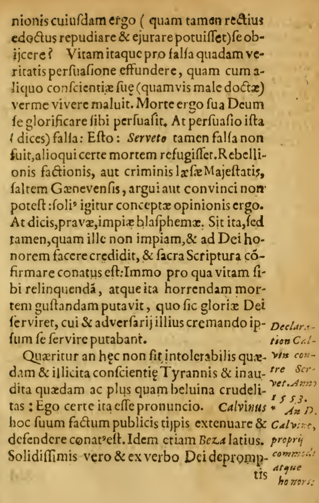

# Contra Libellum Calvini — English Translation Project

An effort to produce an English translation of Sebastian Castellio's *Contra libellum Calvini* ("Against Calvin's Book"), written in 1554 as a response to John Calvin's defense of the execution of Michael Servetus. The work is a landmark text in the history of religious toleration and freedom of conscience.

## Project Overview

This repository documents the full pipeline from source manuscript to English translation:

1. **Source acquisition** — obtaining a scanned copy of the original Latin printing.
2. **OCR / text recognition** — converting the scanned images to machine-readable Latin text.
3. **Margin-text cleanup** — removing editorial marginalia so only the original manuscript text remains.
4. **Translation** — rendering the cleaned Latin into English (forthcoming).

## Source Manuscripts

The translation draws on two scanned copies of the same printing. Both copies appear to derive from the same physical edition — same page layout, fonts, and marginalia — but neither is complete on its own.

**Primary scan (Princeton Theological Seminary):**
- Source: https://commons.ptsem.edu/id/contralibellumca00cast
- Local copy: [`original_document/contralibellumca00cast.pdf`](original_document/contralibellumca00cast.pdf)
- Note: discovered during translation to have a gap with missing pages.

**Secondary scan (Internet Archive):**
- Source: https://archive.org/details/8D6957INV8584FA
- Local copy: [`original_document/8D6957INV8584FA_text.pdf`](original_document/8D6957INV8584FA_text.pdf)
- Supplies pages absent from the Princeton scan.

The working strategy is:
1. Compare the two scans to identify missing or mis-ordered pages in the Princeton copy.
2. Use the Princeton OCR output wherever pages are present and legible.
3. For pages missing from the Princeton scan, perform OCR on the corresponding pages from the Internet Archive scan and insert them in their proper place.

### Page Concordance

Both PDFs were exported to one PNG per page and compared page by page. The numbers below are **scan/PNG sequence positions** (the order of images in each PDF), not the printed page numbers in the book. The two scans are of the same printing, so within each matched range the body content is identical.

| Internet Archive (PNG #) | Princeton (PNG #) | Relationship |
| --- | --- | --- |
| 1–4 | 1–6 | Scan-specific front matter / covers; outside the matched range. |
| 5–185 | 7–187 | Shared content. Princeton = Internet Archive + 2. |
| **186–195** | *(none)* | **Missing from the Princeton scan.** These 10 pages exist only in the Internet Archive scan and belong between Princeton PNG 187 and 188. OCR is needed here. |
| 196–255 | 188–247 | Shared content. Princeton = Internet Archive − 8. |
| *(none)* | 248–250 | Blank pages; the last is a scan of the textless back cover. The Internet Archive scan ends at PNG 255. |

**Implication for OCR:** the existing Transkribus OCR (from the Princeton scan) covers everything *except* the 10-page gap. The only pages requiring fresh OCR are **Internet Archive PNG 186–195**, which are then inserted into the Princeton-derived text between the material corresponding to Princeton PNG 187 and 188.

## OCR / Text Recognition

Text recognition was performed using [Transkribus](https://app.transkribus.org/).

- **Model:** *The Text Titan I ter* (released June 11, 2025)
- **About the model:** Text Titan I ter is a general-purpose Transkribus model for recognizing a wide variety of Latin scripts without custom training. It handles both printed and handwritten texts and performs well on historical documents, making it well suited to early modern printed works like this one.

## Margin-Text Cleanup

Many pages of the original printing include marginal annotations that are *not* part of Castellio's manuscript text — most often cross-references to source works and similar editorial notes. During OCR these marginal notes are frequently interleaved with the main text (sometimes inline within a line, sometimes segregated onto their own lines), as can be seen in the sample page below.

To recover the original manuscript text, each OCR'd page was reviewed manually and the identifiable margin text was removed, leaving (as closely as possible) only Castellio's own words.

### Sample Page

The image below illustrates the margin text problem — note the annotations running down the right-hand margin (e.g. *"Declaratio Calvini contra Serveti. Anno 1553…"*), which were removed during cleanup.

## Status

- [x] Primary source scan acquired (Princeton Theological Seminary)
- [x] OCR performed on primary scan with Transkribus (Text Titan I ter)
- [x] Margin text removed from primary OCR output
- [x] Gap identified in primary scan; supplementary scan located (Internet Archive)
- [x] Page-level comparison of both scans completed (see Page Concordance)
- [ ] OCR performed on the 10 missing pages (Internet Archive PNG 186–195)
- [ ] Missing pages inserted into correct position in OCR output (between Princeton PNG 187 and 188)
- [ ] Final merged Latin OCR text added to repository
- [ ] Translation prompt documented
- [ ] English translation completed and added to repository

## Roadmap

Future additions to this repository will include:

- A page-comparison log noting which pages came from which scan.
- The final merged cleaned OCR Latin text.
- The LLM prompt used to perform the translation.
- A pointer to the completed English translation.

## About the Work

*Contra libellum Calvini* was written under the pseudonym Martinus Bellius (and circulated more widely after Castellio's death). It argues against the persecution and execution of those deemed heretics, responding directly to Calvin's *Defensio orthodoxae fidei* and its justification of Servetus's burning at Geneva in 1553. It stands alongside Castellio's *De haereticis, an sint persequendi* as a foundational document in the development of arguments for toleration and liberty of conscience.

## License

*(To be determined — consider noting the license for your translation and any methodology notes separately from the public-domain source text.)*
